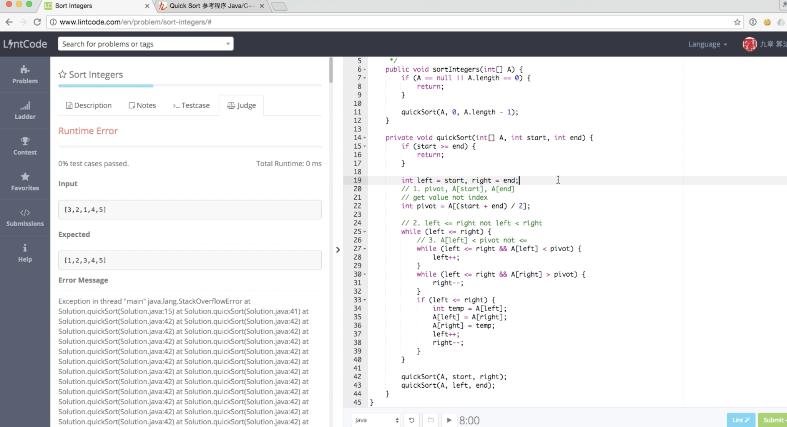

# Notes for 9 chapters Algorithms Course 2020

([Go back to respository ReadMe](../README.md))

---

This is my notes for the 9 chapters Algorithms course 2020. Mainly contains the exercise problesm and code and solutinos.

Class notes are inside Notability. Recorded video are also provided. 

# 第二章【互动】真实面试案例分析（上）与面试评分标准

- Part I Longest palindromic substring
- Part 2 双指针 与 DP 解法.
- Part 3 面试评分体系 and Coding Quality. 

### LC:
[200. Longest Palindromic Substring](https://www.lintcode.com/problem/longest-palindromic-substring/description), 
[sol](https://www.jiuzhang.com/solution/longest-palindromic-substring/)

[667. Longest Palindromic Subsequence](https://www.lintcode.com/problem/longest-palindromic-subsequence/description), [sol](https://www.jiuzhang.com/problem/longest-palindromic-subsequence)

# [第三章【互动】真实面试案例分析（下）与80%求职者会踩坑的基础知识](files/chapter3.md)

- Part I strStr and Rabin-Karp. 
- Part 2 String 的坑.
- Part 3 Greedy Alg.

### LC:
[13. Implement strStr()](https://www.lintcode.com/problem/implement-strstr/description), [sol](https://www.jiuzhang.com/problem/implement-strstr)

[128. Hash Function](https://www.lintcode.com/problem/hash-function/description), [sol](https://www.jiuzhang.com/problem/hash-function/) 

[594. strStr II](https://www.lintcode.com/problem/strstr-ii/description), [sol](https://www.jiuzhang.com/problem/strstr-ii)

Greedy Alg [187. Gas Station](https://www.lintcode.com/problem/gas-station/description), [sol](https://www.jiuzhang.com/problem/gas-station)

---
([Go back to respository ReadMe](../README.md))

# 第四章【互动】复杂度理论与双指针算法入门

- Part I Timing and Space complexity. 
- Part 2 三种双指针算法 two pointers
- Part 3 Use 2 pointers: Valid Palindrome & Valid Palindrome II
- Part 4 Two Sum: HashTable, Sort + 2 pointers, Follow Up Qs

### 学好时间复杂度，有很多帮助，比如：
1. 面试官会问你的算法，时间复杂度是多少
2. 当面试官说，有没有更好的方法时，你知道朝什么样的复杂度优化
3. 利用时间复杂度倒推算法是面试常用技巧。如 O(logN)的算法几乎可以确定是二分法。

### 三种双指针算法
1. 相向双指针 （判断回文串）
   - Reverse type
     - 翻转字符串 flip string 
     - 判断回文串 palindrome
   - Two Sum type
     - sum of two numbers
     - sum of three numbers
   - Partition type
     - quick sort
     - color sort
2. 背向双指针 （最长回文串）
3. 同向双指针  

### Two Sum

||Time Complexity|Space Complexity|
|-|-|-|
|Use HashTable| O(n)|O(n)|
|USe sort + 2 pointers|O(nlogn)|O(1)|

Follow Up:
1. What is sorted already?
2. If require you to return the indices. 
3. Two Sum <= target.

### LC:
[56. Two Sum](https://www.lintcode.com/problem/two-sum/description), [sol](https://www.jiuzhang.com/problem/two-sum/)

[415. Valid Palindrome](https://www.lintcode.com/problem/valid-palindrome/description), [sol](https://www.jiuzhang.com/problem/valid-palindrome/)

[891. Valid Palindrome II](https://www.lintcode.com/problem/valid-palindrome-ii/description), [sol](https://www.jiuzhang.com/problem/valid-palindrome-ii/)

[609. Two Sum - Less than or equal to target](https://www.lintcode.com/problem/two-sum-less-than-or-equal-to-target/description), [sol](https://www.jiuzhang.com/problem/two-sum-less-than-or-equal-to-target)

---
([Go back to respository ReadMe](../README.md))

# 第五章【互动】必须熟练掌握的两个排序算法

|Alg|Time Complexity|Space Complexity|Stability*|DC time*|
|-|-|-|-|-|
|快速排序（Quick Sort）|Avg: O(nlogn); Worst: O(n^2)*|O(1) in place|Not|Do O(n) first|
|归并排序（Merge Sort）|Theta(nlogn)|O(n)*|Yes|Do T(n/2) first|
||

Note *:

1. The **worst case** is when the array is already sorted but pivot select the arr[0] every time, making it become O(1) + O(n^2) => O(n^2).
2. Merge Sort need a seperate new **temporary array** to store.
3. An example for **stability** is that to sort array {2, 1, 1, 2} and we label the two 2s as 2' and 2'' respectively. So we want {2', 1, 1, 2"} to become to {1, 1, 2', 2"} which is called having stability. 
4. When we use **Divide and Conquer (DC)** algorithm we calculate the running time using T(n) = 2T(n/2) + O(n). The QS does the O(n) first. This is called 先整体有序，再局部有序. While MS does the T(n/2) first. This is 先局部有序，在整体有序.

三个要点：

[Quick Sort web](https://www.jiuzhang.com/problem/quick-sort/) or local.
[Merge Sort web](https://www.jiuzhang.com/problem/merge-sort/) or local.

### LC:

[463. Sort Integers](lintcode/463.Sort_Integers.md) QS MS

[1153. string sorting](lintcode/1153.string_sorting.md) QS

[6. Merge Two Sorted Arrays](lintcode/6.Merge_Two_Sorted_Arrays.md) MS

[532. Reverse Pairs](532.Reverse_Pairs.md) MS

## Quick Select

找到n个无序元素中的第K大元素，最简单的办法就是将所有元素排序，再去找第k个元素。但实际上，这个过程中会有许多冗余的操作，我们可以进行一些优化，也就是使用接下来要讲的quick select算法。

### 快速选择算法的 Partition 的实质：

快速选择/快速排序中的 partition 是 可左可右 的partition，也就是说，对于nums[i] == pivot 时，这个数字既可以放在左边，也可以放在右边。

### 为什么这样划分数组呢？

原因是为了避免出现类似 [1,1,1,1,1,1] 的数组中的元素，全部被分到一边的情况。我们让 nums[i] == pivot 的情况既不属于左边也不属于右边，这样就能够让 partition 之后的结果稍微平衡一些。
如果 quick select / quick sort 写成了nums[i] < pivot 在左侧，nums[i] >= pivot 在右侧这种形式，就会导致划分不平均，从而导致错误或者超时。

### 为什么问题《partition array》不能使用同样的代码？

对于问题《partition array》来说，题目的要求是将数组划分为两个部分，一部分满足一个条件，另外一部分不满足这个条件，所以可以严格的把 nums[i] < pivot 放在左侧，把 nums[i] >= pivot 放在右侧，这样子做完一次 partition 之后，就能够将这两部分分开。

### 总结

简单的说就是，quick select 和 quick sort 的 partition 目标不是将数组 严格的按照 nums[i] < pivot 和nums[i] >= pivot 去拆分开，而是只要能够让左半部分 <= 右半部分即可。这样子 nums[i] == pivot 放在哪儿都无所谓，两边都可以放。

### LC:
[5. Kth Largest Element](5.Kth_Largest_Element.md) Quick Select

[80. Median](80.Median.md) Q select

[148. Sort Colors](148.Sort_Colors.md) Q select.

---
([Go back to respository ReadMe](../README.md))

# [第六章【互动】时间复杂度为O(logN)的高频算法——二分法](files/chapter6.md)

在这一节课中，我们要来通过递归来了解二分的基础知识

- Part 1 时间复杂度 - 用 T 函数表示法计算时间复杂度
- Part 2 递归与二分法
- Part 3 空间复杂度 - 内存中的栈空间与堆空间
- Part 4 什么是递归深度

---
([Go back to respository ReadMe](../README.md))

# [第七章【互动】一个不会出现死循环的通用二分法模板](files/chapter7.md)
- 二分查找模版
- 四个要点

---
([Go back to respository ReadMe](../README.md))

# 第八章【视频】高频算法之王——双指针算法之相向双指针

# 第九章【视频】简约而不简单——二分法学习的四重境界

# [第十章【互动】队列知识点从易到难](files/chapter10.md)
- Part 1: Queue 
- Part 2: Implement queue using array and its issue
- Part 3: Implement queue using LinkedList, Implement Circular queue using array
- Part 4: Java Queue Interface, Java Basis: Interface Set Map List Queue
- Part 5: Java Basis: Interface vs Abstract Class

---
([Go back to respository ReadMe](../README.md))

# [第十一章【互动】宽度优先搜索与图论入门](files/chapter11.md)
- Part 1: BFS 3种适用场景
- Part 2: BFS 3种实现方法：单队列，双队列，DummyNode
- Part 3: 图，二叉树的BFS和图的BFS
- Part 4: 如何定义图的数据结构：邻接矩阵，邻接表

# [第十二章【互动】用递归实现遍历法和分治法](files/chapter12.md)
- Part 1: 递归、DFS和回溯的的关联和区别
- Part 2: 使用回溯的时机
- Part 3: 从两个不同的角度：遍历（亲力亲为）和分治（分配任务）来看待问题. 遍历法与分治法的联系与区别

# [第十三章【互动】使用非递归实现二叉树的遍历](files/chapter13.md)
- Part 1: 二叉树的中序遍历的非递归实现
- Part 2: 另一种中序遍历的非递归实现
- Part 3: 浅拷贝和深拷贝

# 第十四章【视频】性价比之王——宽度优先搜索

# 第十五章【视频】解决99%二叉树问题的算法——分治法

---
([Go back to respository ReadMe](../README.md))
