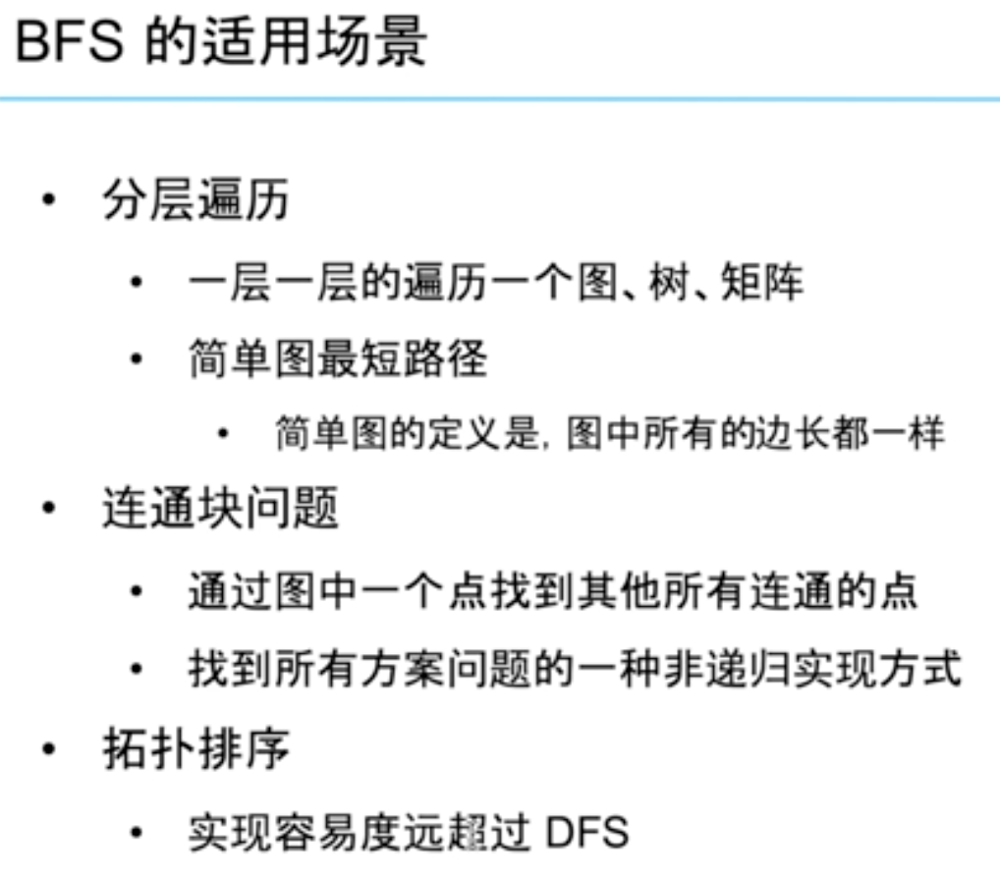
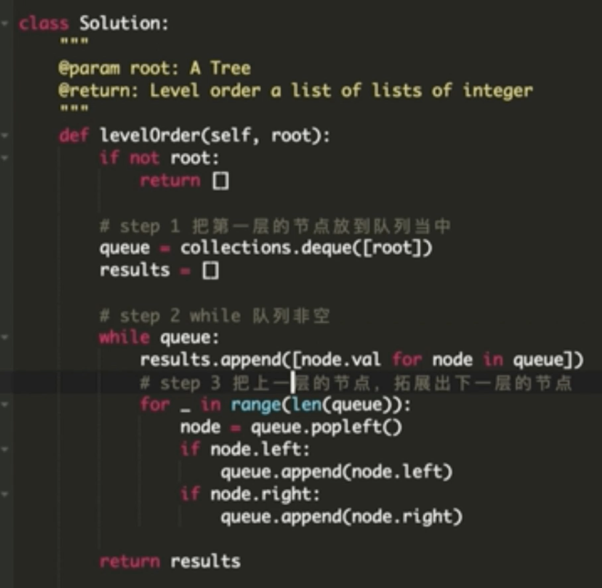
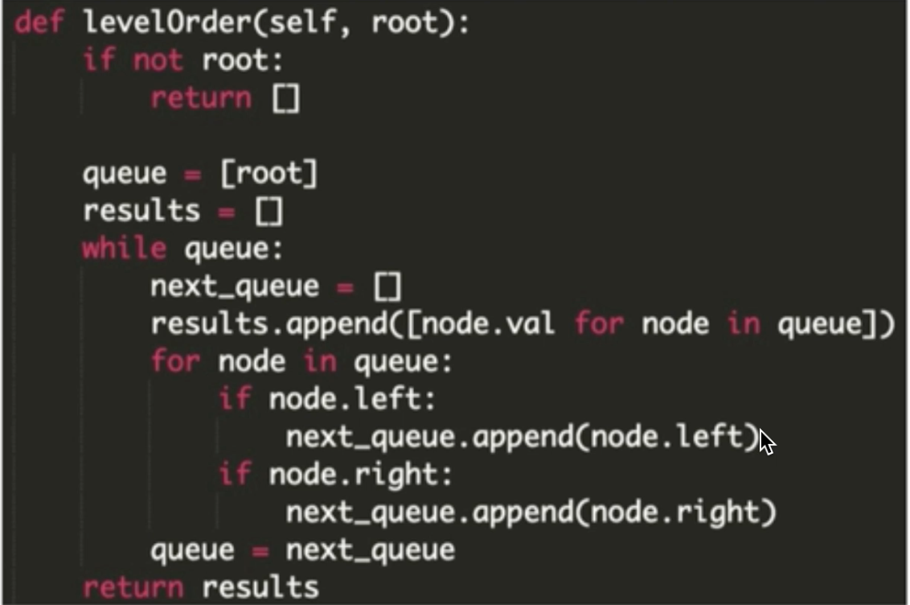
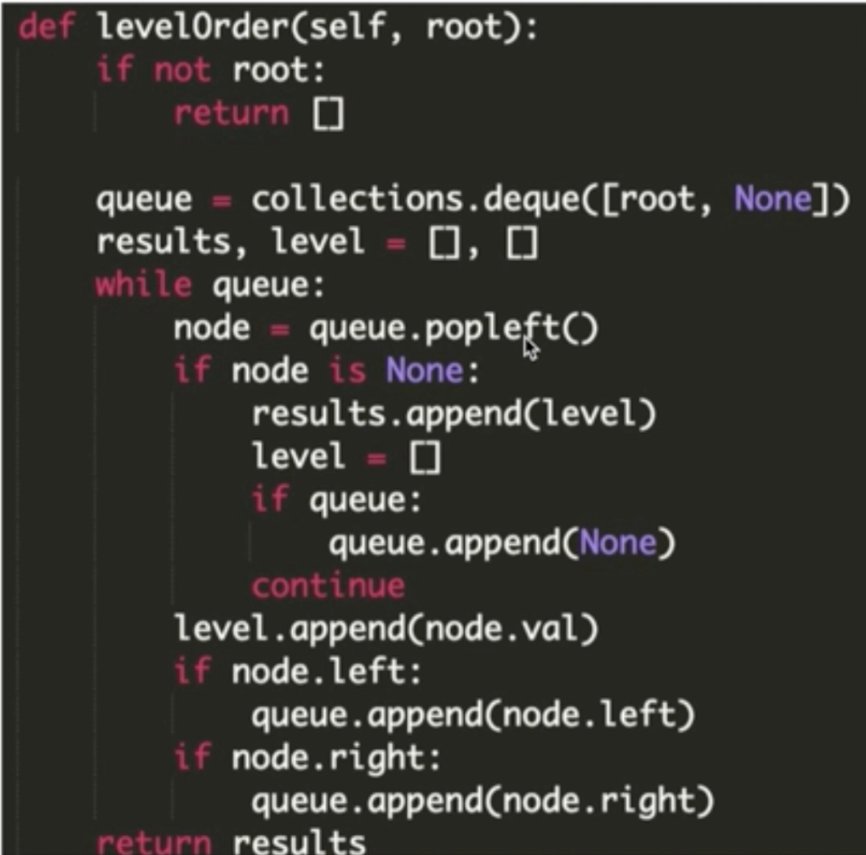
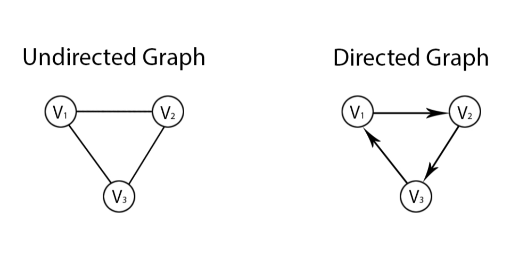

- Part 1: BFS 3种适用场景
- Part 2: BFS 3种实现方法：单队列，双队列，DummyNode
- Part 3: 图，二叉树的BFS和图的BFS
- Part 4: 如何定义图的数据结构：邻接矩阵，邻接表

欢迎来到『九章算法班 2021 版』的第11节课，今天我们一起来学习『宽度优先搜索与图论入门』

在第十章的学习中，我们掌握了“队列”这种数据结构的实现方法和相关面试题目。那么基于之前的内容，这一章我们将首先引入一种面试中的热门算法——宽度优先搜索（简称BFS）算法。在学习了BFS的应用场景以及各种实现方法之后，我们还要接触一类全新的概念：图。除了了解图的基础知识外，还要对学习如何建立图以及存储图。

# 宽度优先搜索BFS的3种适用场景

"第十一章【互动】宽度优先搜索与图论入门1_BFS的3种适用场景.mov"

- 分层遍历
- 连通块问题
- 拓扑排序




以下哪些问题BFS可以处理的：

- A: 二叉树的层次遍历
- B: 求出边长均为5的图的最短路径
- C: 求出边长全不相等的图的最短路径
- D: 二叉树的先序遍历
- E: 求出01矩阵上最大的全0块
- F: 我不会写递归，但是我需要求从10个数中任意拿出5个的所有方案。

先序遍历通常使用递归方式来实现，即使使用非递归方式，也是借助栈来实现的，所以并不适合BFS，而层次遍历因为是一层一层的遍历，所以是BFS十分擅长的；边长一致的图是简单图，所以可以用BFS，因此B可以，因为BFS只适用于简单图，所以C不可以；矩阵连通块也是BFS可以处理的问题，求出最大块只需要维护一个最大值即可；选项F属于求所有方案问题，因此可以用BFS来处理，但是并不是唯一的解决方式。

答对啦！正确答案是 A B E F

# BFS的三种实现方法
- 单队列 （最简单，最推荐）
- 双队列
- DummyNode


# 使用单队列方法实现BFS

第十一章【互动】宽度优先搜索与图论入门2_BFS的3种实现方法1_单队列方法.mov

[69. Binary Tree Level Order Traversal](../lintcode/69.Binary_Tree_Level_Order_Traversal.md)




# 使用双队列方法实现BFS

第十一章【互动】宽度优先搜索与图论入门3_BFS的3种实现方法2_双队列方法.mov

[69. Binary Tree Level Order Traversal](../lintcode/69.Binary_Tree_Level_Order_Traversal.md)

同样的问题双队列解决：


# 使用用DummyNode思想实现BFS

第十一章【互动】宽度优先搜索与图论入门4_BFS的3种实现方法3_DummyNode方法.mov

[69. Binary Tree Level Order Traversal](../lintcode/69.Binary_Tree_Level_Order_Traversal.md)

同样的问题DummyNode解决：



如果你已经用三种方式AC了上述题目，那么你已经基本掌握了BFS的实现与使用方法。

你最喜欢哪种BFS的实现方式呢？
A: 简洁有效，单队列一生推
B: 直白易懂，双队列无敌
C: 缩进优雅，DummyNode颜值粉
D: 啥是BFS，DFS它不香吗

--- 
下面让我们继续学习有关图的知识。

# 图

什么是图（Graph）？

图在离线数据中的表示方法为 ```<E, V>```，E表示 Edge，V 表示 Vertex。也就是说，图是**顶点（Vertex）和边（Edge）的集合**。

图分为：
- 有向图（Directed Graph）
- 无向图（Undirected Graph）

BFS 大部分的时候是在图上进行的。

BFS 在两种图上都适用。另外，树（Tree）也是一种特殊的图。

下图中左为无向图，右为有向图。


# 二叉树的BFS vs 图的BFS：

二叉树中进行 BFS 和图中进行 BFS 最大的区别就是二叉树中无需使用 HashSet（C++: unordered_map, Python: dict) 来存储访问过的节点（丢进过 queue 里的节点）

因为二叉树这种数据结构，上下层关系分明，没有环（circle），所以不可能出现一个节点的儿子的儿子是自己的情况。

但是在图中，一个节点的邻居的邻居就可能是自己了。

下列哪些有关树和图的说法是正确的？
- A:树就是树，图就是图，没有任何关联。
- B:在图中搜索需要使用HashSet来存储已访问的节点。
- C:在二叉树上搜索需要使用HashSet来存储已访问的节点。
- D:如果一个图的顶点数减1等于边的数量，那么这个图是一棵树。
- E:图上的节点的邻居节点可能是自己，但树上的节点的儿子节点不可能是自己

因为树可以被认为是一种特殊的图，所以A是错的；图和二叉树上的BFS最大的区别就是在二叉树上搜索不需要记录已访问的节点；我们假设一张图有4个顶点，其中1与2有一条边，2与3有一条边，3与1有一条边，即使节点4没有边，这4个点也构成图，只是图不连通而已；图上的节点如果有一条边连接自己，那么就形成了自环，自环在图中是可以存在的。

正确答案是 B E 

# 如何定义一个图的数据结构？

有很多种方法可以存储一个图，最常用的莫过于：
1. 邻接矩阵
2. 邻接表

而邻接矩阵因为耗费空间过大，我们通常在工程中都是使用邻接表作为图的存储结构。

## 邻接矩阵 Adjacency Matrix
```
[
[1,0,0,1],
[0,1,1,0],
[0,1,1,0],
[1,0,0,1]
]
```
例如上图表示0号点和3号点有连边。1号点和2号点有连边。

当然，每个点和自己也是默认有连边的。

图中的 0 表示不连通，1 表示连通。

我们也可以用一个更具体的整数值来表示连边的长度。

邻接矩阵我们可以直接用一个二维数组表示，如

int[][] matrix;

这种数据结构因为耗费 O(n^2) 的空间，所以在稀疏图上浪费很大，因此并不常用。

## 邻接表 (Adjacency List)
```
[
[1],
[0,2,3],
[1],
[1]
]
```
这个图表示 0 和 1 之间有连边，1 和 2 之间有连边，1 和 3 之间有连边。即每个点上存储自己有哪些邻居（有哪些连通的点）。

这种方式下，空间耗费和边数成正比，可以记做 O(m)，m代表边数。m最坏情况下虽然也是 O(n^2)，但是邻接表的存储方式大部分情况下会比邻接矩阵更省空间。

可以用自定义的类来实现邻接表
Java:
```java
class DirectedGraphNode {
int label;
List neighbors;
...
}
```
Python:
```python
def DirectedGraphNode:
def init(self, label):
self.label = label
self.neighbors = [] # a list of DirectedGraphNode's
...
```

也可以使用 HashMap 和 HashSet 搭配的方式来存储邻接表
Java:
```java
Map<T, Set> = new HashMap<Integer, HashSet>();
```
Python:
```python
#假设nodes为节点标签的列表:
#使用了Python中的dictionary comprehension语法
adjacency_list = {x:set() for x in nodes}
```
另一种写法
```python
adjacency_list = {}
for x in nodes:
adjacency_list[x] = set()
```
其中 T 代表节点类型。通常可能是整数(Integer)。

这种方式虽然没有上面的方式更加直观和容易理解，但是在面试中比较节约代码量。

而自定义的方法，更加工程化，所以在面试中如果时间不紧张题目不难的情况下，推荐使用自定义邻接表的方式。

以上就是本章对于"图"这方面知识点的介绍，更具体的解题方法和应用请期待第18章的直播课——宽度优先搜索进阶。

看到这里，你是不是已经摩拳擦掌，跃跃欲试了呢？那么请尽量完成下面的几道习题，巩固我们刚刚学到的知识。

# LC:
[1179. Friend Circles](../lintcode/1179.Friend_Circles.md)

[630. Knight Shortest Path II](../lintcode/630.Knight_Shortest_Path_II.md)

[120. Word Ladder](../lintcode/120.Word_Ladder.md)

# 为什么 BFS 可以搜索到最短路？

因为BFS是按照层级进行搜索，所以搜到答案时，一定是最短的一条路径。

我们可以使用反证法进行证明：

我们假设当前搜索到的路径 Y 不是最短的，那就说明存在一条更短的路径 X（即 X < Y）。

令路径 X 中的所有点是 {x1,x2,...,xx}。

那么x1是起点，且为 BFS 的第一层，x2为第二层......xx为第x层，

此时的结果与BFS中第Y层初次遇到xx点产生矛盾。

因此不存在任何一条比Y短的路径能找到终点。

# 本章小结：

我们首先了解了宽度优先搜索的适用场合（分层遍历，连通块问题，拓扑排序）；

然后我们学习了三种BFS的实现方式（单队列，双队列，DummyNode）；

最后我们接触到了一种全新的知识——图，并对图的存储方式有了一定了解。

下章预告：

接下来的一章，我们将着重学习另一种搜索方式深度优先搜索（DFS），以及掌握实现DFS所使用的通常技巧——递归。

最后的最后，请各位同学认真复习本章知识，坚持就是胜利！