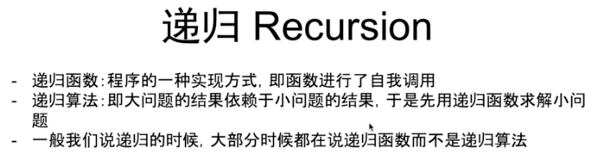
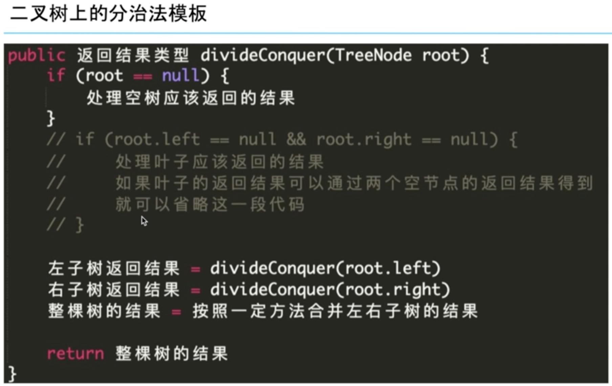

欢迎来到『九章算法班 2021 版』的第12节课，今天我们一起来学习『用递归实现遍历法和分治法』

在第11章中，我们主要讲解了BFS的实现和使用。在本章的学习中，我们讲解一种编程中的技巧——递归，以及可以利用递归实现的另一种搜索方法，深度优先搜索（简称DFS）。然后学习对DFS的应用，体会遍历与分治的思想。

在过去的学习中，同学应该已经对递归有了一定的认识。
下面就让老师来系统的讲解一下，递归，深度优先搜索和回溯这三者的联系与区别在哪里。

# 递归，深度优先搜索和回溯这三者的联系与区别

第十二章【互动】用递归实现遍历法和分治法1 - 递归 深搜 回溯之间的联系和区别.mov

下列关于递归、DFS与回溯法的说法中，那些是正确的？
- A:DFS的函数一定是一个递归函数。
- B:我们在使用递归函数的时候，需要自己建立一个栈
- C:可以认为，回溯法就是深度优先搜索
- D:在满二叉树中，DFS和BFS的搜索顺序是相同的，只是实现方式不同。

DFS可以使用非递归来实现；使用递归函数的时候，我们使用的是操作系统中的栈，所以不需要手动建立栈；DFS和BFS的搜索顺序是截然不同的，除非是在一条链上搜索。

正确答案是 C 

# 应该什么时候在搜索中加入“回溯”操作

在上一个视频中，我们了解了回溯法和回溯操作。

同学们可能会有疑问：什么时候应该进行“回溯”呢？

老师准备了两段代码，让我们来看看具体应该什么时候在搜索中加入“回溯”操作吧！
## 找点和找路径的代码的实现区别

第十二章【互动】用递归实现遍历法和分治法2- 找点和找路径的代码的实现区别.mov

# LC
[480. Binary Tree Paths](../lintcode/480.Binary_Tree_Paths.md)

# 遍历法与分治法的联系与区别

学习到现在，我相信你已经对DFS有了比较到位的理解，下面让我们进入应用的范畴，看看遍历与分治这两种不同的思想能与DFS能摩擦出什么样的火花。

第十二章【互动】用递归实现遍历法和分治法3 - 遍历法与分治法的联系与区别.mov

下列有关遍历与分治的理解，哪些是错误的？
- A: 遍历法是一种“事必躬亲”的思想。
- B: 分治法的特点之一是可以使用一些参数来描述问题的规模。
- C: 分治思想就是将问题一分为二的思想。
- D: 分治法和遍历法没有任何联系。

分治法是一种将大问题分解为小问题的思想，不一定是二分的；分治在某些情况上来看是一种特殊的遍历，所以他们之间并非没有联系。

正确答案是 C D

通过上一段视频的讲解，是否解开了你心中的疑惑呢？
下面让我们通过一道例题，实战一下。

# LC
第十二章【互动】用递归实现遍历法和分治法4 - 93判断平衡二叉树.mov

[93. Balanced Binary Tree](../lintcode/93.Balanced_Binary_Tree.md)

[97. Maximum Depth of Binary Tree](../lintcode/97.Maximum_Depth_of_Binary_Tree.md)

[628. Maximum Subtree](../lintcode/628.Maximum_Subtree.md)

[65. Median of two Sorted Arrays](../lintcode/65.Median_of_two_Sorted_Arrays.md)

能做出 median of two sorted arrays 的小伙伴们看来已经掌握了分治法的真谛，对任何题目都束手无策的同学建议多加复习和思考，感受分而治之的思想带来的灵感。

课上的时间总是那么短暂，又到了章末总结啦，让我们想想这章都学了什么？

首先我们认识了递归、DFS和回溯的的关联和区别；接下来了解了使用回溯的时机，并从两个不同的角度：遍历（亲力亲为）和分治（分配任务）来看待问题；最后我们一起对分治法这个重点知识进行了实战训练。

在下一章中，我们将对这节课抛出的一个引子——非递归实现DFS，这个问题展开讨论。

还将介绍如何实现二叉查找树（BST）的迭代器。

还请同学期待下一章的精彩讲解。