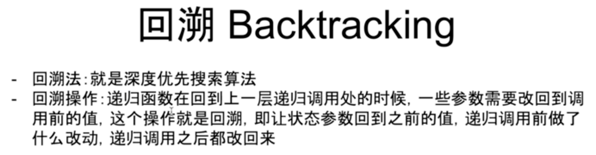

欢迎来到『九章算法班 2021 版』的第12节课，今天我们一起来学习『用递归实现遍历法和分治法』

在第11章中，我们主要讲解了BFS的实现和使用。在本章的学习中，我们讲解一种编程中的技巧——递归，以及可以利用递归实现的另一种搜索方法，深度优先搜索（简称DFS）。然后学习对DFS的应用，体会遍历与分治的思想。

在过去的学习中，同学应该已经对递归有了一定的认识。
下面就让老师来系统的讲解一下，递归，深度优先搜索和回溯这三者的联系与区别在哪里。

# 递归，深度优先搜索和回溯这三者的联系与区别

第十二章【互动】用递归实现遍历法和分治法1 - 递归 深搜 回溯之间的联系和区别.mov

下列关于递归、DFS与回溯法的说法中，那些是正确的？
- A:DFS的函数一定是一个递归函数。
- B:我们在使用递归函数的时候，需要自己建立一个栈
- C:可以认为，回溯法就是深度优先搜索
- D:在满二叉树中，DFS和BFS的搜索顺序是相同的，只是实现方式不同。

DFS可以使用非递归来实现；使用递归函数的时候，我们使用的是操作系统中的栈，所以不需要手动建立栈；DFS和BFS的搜索顺序是截然不同的，除非是在一条链上搜索。

正确答案是 C 

# 应该什么时候在搜索中加入“回溯”操作

在上一个视频中，我们了解了回溯法和回溯操作。

同学们可能会有疑问：什么时候应该进行“回溯”呢？

老师准备了两段代码，让我们来看看具体应该什么时候在搜索中加入“回溯”操作吧！
## 找点和找路径的代码的实现区别

第十二章【互动】用递归实现遍历法和分治法2- 找点和找路径的代码的实现区别.mov

# LC
[480. Binary Tree Paths](../lintcode/480.Binary_Tree_Paths.md)

