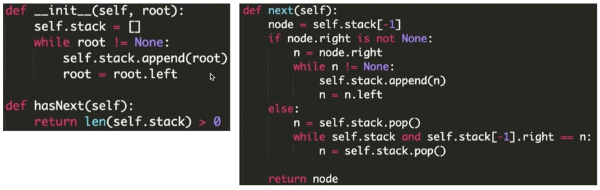
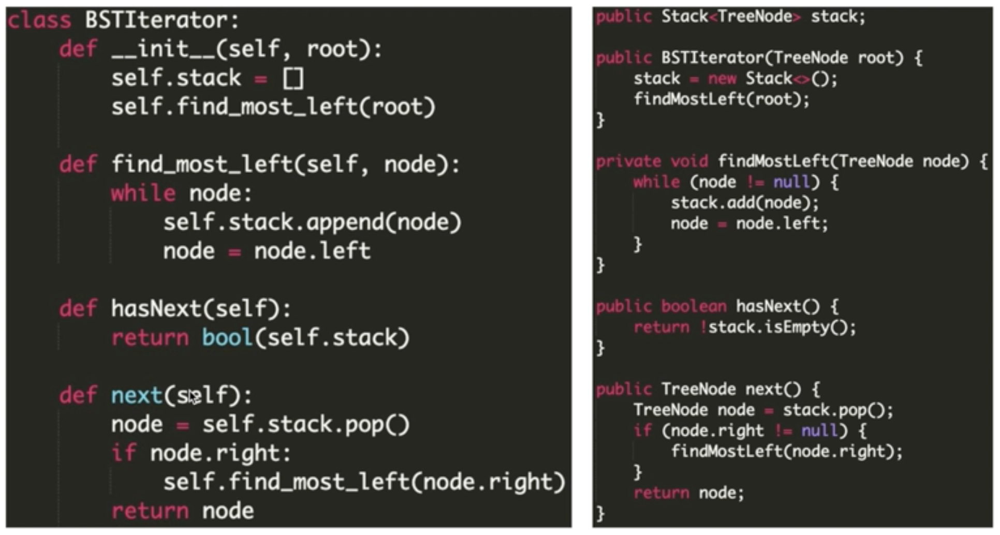

- Part 1: 二叉树的中序遍历的非递归实现
- Part 2: 另一种中序遍历的非递归实现
- Part 3: 浅拷贝和深拷贝


第13节课，今天我们一起来学习『使用非递归实现二叉树的遍历

在12章里我们学习了递归实现DFS的方法，同时我们学习了DFS的非递归实现方法。
今天的内容将在一种特殊的二叉树——二叉查找树上进行，各位同学请努力学习。

那么下面就和令狐老师一起来学习如何实现“二叉树的中序遍历”的非递归实现吧。

# 二叉树的中序遍历的非递归实现

第十三章【互动】使用非递归实现二叉树的遍历1 - 二叉树的中序遍历的非递归实现.mov

下列哪些说法是错误的？
- A:BST中最小的节点是树的最深层的最左边的点。
- B:BST的中序遍历是一个严格递增的序列。
- C:找到BST的最小值节点的算法时间复杂度是O(logn)的。
- D:一棵树的中序遍历结果为：1-2-4-3-4-5，这棵树可能是一个BST。

BST中最小的节点是从根节点一直往左走遇见的叶子节点，它不一定在树的最底层；BST的特征就是中序遍历是严格递增的，所以D是错误的；如果这颗BST是一条链，那么找到最小值节点的算法是O(n)的，除非这个BST是一个满二叉树，所以C是错误的。

正确答案是 A C D 


刚才的代码你可以做到“阅读全文并背诵”嘛，如果不能，也不要着急哦。

下面的视频会对我们刚才学到的代码进行一定的优化，那我们看看精简后的代码长成什么样吧~

第十三章【互动】使用非递归实现二叉树的遍历2 - 另一种中序遍历的非递归实现.mov
[要求背诵]




这份模板不仅仅是BST，在普通的二叉树上能用到哦，还希望各位同学能尽量理解并背诵下来，也许在未来的某一天，你可以凭借这个模板脱颖而出呢。

在学会了课上的内容后，别忘了将视频中的习题AC哦~

# LC

[86. Binary Search Tree Iterator](../lintcode/86.Binary_Search_Tree_Iterator.md)

[900. Closest Binary Search Tree Value](../lintcode/900.Closest_Binary_Search_Tree_Value.md)

[901. Closest Binary Search Tree Value II](../lintcode/901.Closest_Binary_Search_Tree_Value_II.md)


# 深拷贝和浅拷贝

为了让大家在下节课有更好的听课体验，我们这里补充两个知识点，深拷贝和浅拷贝

## 浅拷贝

下面一段代码最后输出是
```python
# Python代码
list1 = [1,2,3]
list2 = list1
    
# print(id(list1), id(list2))
list1[0] = 4
list2[1] = 5

print(list1, list2)
// Java代码
int[] list1 = {1,2,3};
int[] list2 = list1;

// System.out.println(list1);
// System.out.println(list2);
list1[0] = 4;
list2[1] = 5;

System.out.println(Arrays.toString(list1) + Arrays.toString(list2));

A:
[4,2,3] [1,5,3]
B:
[4,5,3] [4,5,3]
C:
[4,2,3] [4,5,3]
D:
[4,2,3] [4,2,3]
```

此种方式被称为浅拷贝 list2 = list1，两个列表同时指向一个内存地址 。第一次在地址空间中申请了 list1，里面的数据是1，2，3，然后让 list2 来接收 list1 的地址。因为两个列表指向的是同一个地址空间，所以 list1[0] = 4 这种操作会同时修改两个列表，感兴趣的同学可以把两个列表的地址空间（id）输出一下看看（代码中注释行打印的是两个列表的地址）

正确答案是 B


## 深拷贝

下面一段代码最后输出是
```python
# Python代码
list1 = [7,8,9]
list2 = list(list1)

# print(id(list1), id(list2))

list1[0] = 10
list2[1] = 15

print(list1, list2)
// Java代码
int[] list1 = {7,8,9};
int[] list2 = new int[3];

System.arraycopy(list1, 0, list2, 0, list1.length);
// System.out.println(list1);
// System.out.println(list2);
        
list1[0] = 10;
list2[1] = 15;
System.out.println(Arrays.toString(list1) + Arrays.toString(list2));
A:
[10,15,9] [10,15,9]
B:
[10,8,9] [7,15,9]
C:
[10,15,9] [7,15,9]
D:
[10,15,9] [7,8,9]
```

此种方式被称为深拷贝 list2 = list(list1)，相当于我将 list1 的数据复制了一份，然后放到了新的列表中，两个列表指向的是不同的地址空间。这样的话，list1[0] = 10 这种操作就只作用于自己本身对象的值，感兴趣的同学可以把两个列表的地址空间（id）输出一下看看（注释行打印的是两个列表的地址）。

正确答案就是 B 

在本章中，我们学习了BST迭代器的模板，希望同学能够熟练掌握。
在接下来的两节直播课中，我们将对宽度优先搜索和分治法进行进阶训练。
到这里就是本章的全部内容了，同学再见咯。